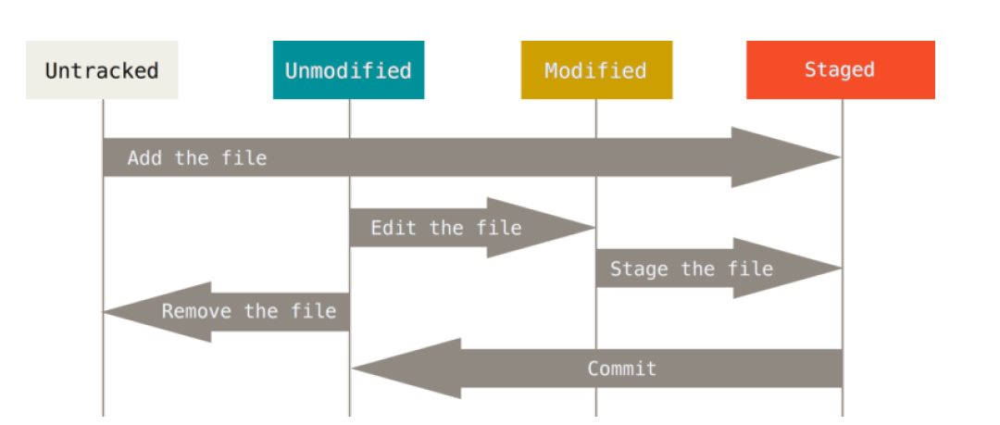

# Git基础

### 1. 获取Git仓库

获取Git项目仓库的方法有两种：

+ 将现有项目或目录下导入所有文件到Git中
+ 从一个服务器克隆一个现有的仓库

#### 1.1 将现有项目或目录下导入所有文件到Git中

```shell
$ git init
```

该命令在当前文件夹创建一个`.git`子目录，这个子目录中包含了Git仓库初始化所需的文件。

#### 1.2 从一个服务器克隆一个现有的仓库

```shell
$ git clone [url]
```

该命令会将远程仓库克隆到本地。

### 2. 记录每次更新到仓库




工作目录下的文件共有两种状态：已跟踪和未跟踪。已跟踪的文件是指被纳入了版本控制的文件，在上一次快照中有它们的记录。如上图所示，

+ 未跟踪的文件通过`git add <file>`命令转变未暂存的文件；
+ 暂存的文件通过`git commit`命令转变为未修改的文件；
+ 当我们编辑了文件之后，未修改的文件会转变为已修改的文件
+ 已修改的文件通过`git add <file>`将修改的部分提交到暂存区，文件状态转变为暂存状态；
+ 未修改状态下的文件可以通过`git rm <file>`命令从版本控制中删除。

#### 2.1 检查当前文件的状态`git status`

```shell
$ echo 'My Project' > README
$ git status
On branch master
Untracked files:
	(use "git add <file>..." to include in what will be committed)
	README
nothing added to commit but untracked files present (use "git add" to track)
```

#### 2.2 跟踪新文件`git add`

```shell
$ git add README
$ git status
On branch master
Changes to be committed
	(use "git reset HEAD <file>..." to unstage)
	new file: README
```

#### 2.3 暂存已修改的文件`git add`

```shell
$ git status
On branch master
Changes to be committed:
	(use "git reset HEAD <file>..." to unstage)
	new file: README
Changes not staged for commit:
	(use "git add <file>..." to update what will be committed)
	(use "git checkout -- <file>..." to discard changes in working
directory)
modified: CONTRIBUTING.md
$ git add CONTRIBUTING.md
$ git status
On branch master
Changes to be committed:
	(use "git reset HEAD <file>..." to unstage)
	new file: README
	modified: CONTRIBUTING.md
```

`git add`命令是一个多功能命令：

+ 跟踪新文件
+ 将已跟踪的文件放到暂存区
+ 合并时将有冲突的文件标记为已解决状态

#### 2.4 忽略文件`.gitignore`

我们通常忽略将项目运行、编译过程中创建的临时文件加到git中，因此我们可以创建一个名为`.gitignore`的文件，`.gitignore`的格式规范如下：

+ 所有空行或者以#号开头的行都会被Git忽略
+ 可以使用标准的glob模式匹配
+ 匹配模式可以以`/`开头防止递归
+ 匹配模式可以以`/`结尾指定目录
+ `!`表示取反

#### 2.5 查看已暂存和未暂存的修改`git diff`

`git diff`命令的作用有两个：

+ 比较当前目录与暂存区的区别
+ 比较暂存区与本地git仓库的区别

##### 2.5.1 比较当前目录与暂存区的区别`git diff`

```shell
$ git diff
```

##### 2.5.2 比较暂存区与本地git仓库的区别`git diff --cached`

```shell
$ git diff --staged
```

#### 2.6 提交更新`git commit`

```shell
$ git commit
```

这一步的作用是将暂存区中的文件保存到本地git仓库中。

#### 2.7 跳过使用暂存区域`git commit -a`

```shell
$ git commit -a
```

这条命令会先将已跟踪的文件的更改提交到暂存区，然后将暂存区提交到本地仓库。

#### 2.8 移除文件`git rm`

```shell
$ git rm <file>
```

该命令会将指定的文件从跟踪列表中删除，并将其从工作目录中删除，这样该文件以后就不会出现在未跟踪列表中了。

如果只是在工作目录中删除了该文件，那么运行`git status`命令会在出现形如下面的输出

```shell
$ rm PROJECTS.md
$ git status
On branch master
Your branch is up-to-date with 'origin/master'.
Changes not staged for commit:
	(use "git add/rm <file>..." to update what will be committed)
	(use "git checkout -- <file>..." to discard changes in working
directory)
	deleted: PROJECTS.md
no changes added to commit (use "git add" and/or "git commit -a")
```

这时我们需要使用`git rm <file>`命令记录此次的移除文件的操作，因此为了方便，在移除文件的时候，尽量直接使用`git rm <file>`命令直接删除。

如果在删除之前，文件被修改过并且添加到了暂存区，在删除的时候我们需要执行下面的命令

```shell
$ git rm -f <file>
```

这是git为了我们误删还没有添加到快照总的数据的安全措施。

如果我们误将不希望添加到跟踪列表的文件添加到了跟踪列表，可以执行下面的命令

```shell
$ git rm --cached <file>
```

然后在`.gitignore`文件中将该文件加入。

#### 移动文件`git mv`

```shell
$ git mv <file>
```

该命令常常被用来修改文件名称。