# Git分支

> Note: 在markdown中使用windows下的路径分割符表示图片路径在`github`网站中不能显示图片。

### 1. 分支简介

`Git`保存的不是文件的变化或者文件的差异，而是一系列不同时刻的文件快照。

创建两个文件：

```shell
$ git init
$ echo "111" > a.txt
$ echo "222" > b.txt
$ git add *.txt
```

`Git`会将整个数据库存储在`.git`目录下，如果此时去查看`.git/objects`目录，你会发现仓库中多了两个`object`

```shell
$ tree .git/objects
.git/objects
├── 58
│   └── c9bdf9d017fcd178dc8c073cbfcbb7ff240d6c
├── c2
│   └── 00906efd24ec5e783bee7f23b5d7c941b0c12c
├── info
└── pack
```

可以使用`git cat-file`命令查看`object`的类型和存储的具体内容：

```shell
$ git cat-file -t 58c9
blob
$ git cat-file -p 58c9
111
```

`blob`类型的对象存储的是一个文件的内容，不包括文件名等其他信息。然后将这些信息经过`SHA1`哈希算法得到对应的哈希值`58c9bdf9d017fcd178dc8c073cbfcbb7ff240d6c`，作为这个`object`在`Git`仓库中的唯一身份证。

此时我们的`Git`仓库是这样子的：


接着执行提交操作：

```shell
$ git commit -am '[+] init'
$ tree .git/objects
.git/objects
├── 0c
│   └── 96bfc59d0f02317d002ebbf8318f46c7e47ab2
├── 4c
│   └── aaa1a9ae0b274fba9e3675f9ef071616e5b209
...
```

这时`Git`仓库中多了两个`object`，使用`cat-file`命令查看类型和内容：

```shell
$ git cat-file -t 4caaa1
tree
$ git cat-file -p 4caaa1
100644 blob 58c9bdf9d017fcd178dc8c0...     a.txt
100644 blob c200906efd24ec5e783bee7...    b.txt
```

`tree`类型的对象是对当前目录结构的一个快照，它存储了一个目录结构，其中包括每个文件或文件夹的权限、类型、对应的`SHA1`值以及文件名。

此时的`Git`仓库是这样的：


紧接着我们发现第三种类型的对象`commit`。它存储的是一个提交的信息，其中包括对应目录结构的快照`tree`的哈希值，上一个提交的哈希值、提交的作者、提交的信息和提交的具体时间。

```shell
$ git cat-file -t 0c96bf
commit
$ git cat-file -p 0c96bf
tree 4caaa1a9ae0b274fba9e3675f9ef071616e5b209
author lzane 李泽帆  1573302343 +0800
committer lzane 李泽帆  1573302343 +0800
[+] init
```

此时的`Git仓库是这样的：`


此时查看分支信息：

```shell
$ cat .git/HEAD
ref: refs/heads/master

$ cat .git/refs/heads/master
0c96bfc59d0f02317d002ebbf8318f46c7e47ab2
```

此时会发现`master`分支中存储的信息就是上一次提交的`commit`对象的`SHA1`值。在`Git`仓库中，`HEAD`、分支和普通的`tag`可以简单理解为一个指针，指向对应的`commit`的`SHA1`值。


从上图可以看出`HEAD`指向`master`，`master`指向`commit`对象。

其实`Git`中还有一个对象那就是`tag`类型的对象，其对应`Git`中的附注标签。


这里有三个区域，所存储的信息分别为

- 工作目录 （ working directory ）：操作系统上的文件，所有代码开发编辑都在这上面完成。
- 索引（ index or staging area ）：可以理解为一个暂存区域，这里面的代码会在下一次commit被提交到Git仓库。
- Git仓库（ git repository ）：由Git object记录着每一次提交的快照，以及链式结构记录的提交变更历史。

### 2. 分支的新建与合并

下面我们将以显示中常常遇到的情况作为例子来讲解分支的新建和合并：

1. 开发某个网站。
2. 为实现某个新的需求，创建一个分支。
3. 在这个分支上开展工作。
4. 切换到你的线上分支（production branch）。
2. 为这个紧急任务新建一个分支，并在其中修复它。
3. 在测试通过之后，切换回线上分支，然后合并这个修补分支，最后将改动推送到线上分支。
4. 切换回你最初工作的分支上，继续工作。

假设当前的提交历史如下图所示：


首先我们为了实现某个新需求，创建了一个分支`iss53`

```shell
$ git checkout -b iss53
```

该命令创建了新的分支并切换到该分支上。该命令可以分解为：

```shell
$ git branch iss53
$ git checkout iss53
```


然后我们在该分支做了一些工作并进行了一次提交

```shell
$ nvim index.html
$ git commit -a -m "added a new file: index.html [iss53]"
```


紧接着我接到了那个电话，然后我需要先切换到master分支上，然后再该基础上创建一个新的分支`hotfix`，然后再该分支上针对该问题做修复。

```shell
$ git checkout master
$ git checkout -b hotfix
$ nvim index.html
$ git commit -a -m "fixed the broken email address [hotfix]"
```


当我们保证​`​BUG`:bug:已经被修复了，那么我们将可以将该分支合并到主分支上。没有任何冲突的合并再`Git`中称为`fast-forward`快进。

```shell
$ git checkout master
$ git merge hotfix
```


接下来我们就可以将`hotfix`分支删除了

```shell
$ git branch -d hotfix
```


下面我们可以返回`iss53`分支上继续之前的工作

```shell
$ git checkout iss53
$ nvim index.html
$ git commit -a -m "finished the new footer [iss53]"
```

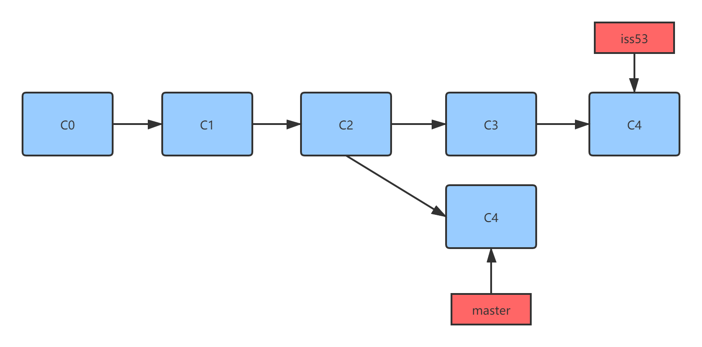

现在我们在分支`iss53`上的工作已经完成了，那么接下来我们就可以将该分支合并到主分支上了。注意，这里的分支合并和之前的分支合并不同，这里的master分支所在的提交并不是`iss53`分支所在的提交的直接祖先，而是两个提交有一个共同的祖先，这里我们需要做一个三方的合并。

```shell
$ git checkout master
$ git merge iss53
```


然后删除掉`iss53`分支即可

```shell
$ git branch -d iss53
```

当然上面的三方合并是有可能产生冲突的，比如在分支`iss53`上的`index.html`内容如下

```html
<html>
    <body>
        <h1>
            Hello, Iss53!
        </h1>
    </body>
</html>
```

`master`分支上：

```html
<html>
    <body>
        <h2>
            Hello, Master!
        </h2>
    </body>
</html>
```

公共节点：

```html
<html>
    <body>
        <p>
            Hello, World!
        </p>
    </body>
</html>
```

这时两个分支都对公共节点的内容做了修改，并且修改的地方是相同的，因此在合并时到底保留哪一个更改需要程序员自己做出判断。

```shell
$ git merge iss53
Auto-merging index.html
CONFLICT (content): Merge conflict in index.html
Automatic merge failed; fix conflicts and then commit the result.
```

在手动解决冲突之后，需要使用`git add`命令标记冲突已经解决。然后将暂存区提交形成一个合并节点。

我们可以使用`git mergetool`命令按照提示一步一步解决冲突

```shell
git mergetool
```

然后可以使用`git status`命令来查看冲突是否被解决

```shell
$ git status
On branch master
All conflicts fixed but you are still merging.
	(use "git commit" to conclude merge)
Changes to be committed:
	modified: index.html
```

### 3. 分支管理

#### 3.1 查看分支列表`git branch`

```shell
$ git branch
  iss53
* master
  testing
```

注意使用`*`号标注的分支是现在检出的分支，即`HEAD`指针指向的分支。

#### 3.2 查看每个分支最新一次的提交`git branch -v`

```shell
$ git branch -v
  iss53 93b412c fix javascript issue
* master 7a98805 Merge branch 'iss53'
  testing 782fd34 add scott to the author list in the readmes
```

#### 3.3 查看哪些分支已经合并到当前分支`git branch --merged`

```shell
$ git branch --merged
  iss53
* master
```

因为我们之前合并了iss53分支，因此可以看到该分支在列表中，通常输出中没有星号的分支可以使用`git branch -d`删除掉。

#### 3.4 查看哪些分支还没有合并当前分支`git branch --no-merged`

```shell
$ git branch --no-merged
  testing
```

因为我们还没有合并过`testing`分支，因此该分支显示在列表中，这时如果我们尝试使用`git branch -d`删除分支，则会失败。

```shell
$ git branch -d testing
error: The branch 'testing' is not fully merged.
If you are sure you want to delete it, run 'git branch -D testing'.
```

如果你想要强制删除，使用`git branch -D`

### 4. 远程分支

远程引用是对远程仓库的引用，包括分支、标签等等。可以通过`git ls-remote(remote)`来显式地获取远程引用地完整列表。还可以通过`git remote show (remote)获取远程分支地更多信息。`

远程跟踪分支是对远程分支状态的引用，它是你不能移动的本地引用。当做任何的网络通信操作时，它们会自动移动。

远程跟踪分支的命名形式为`(remote)/(branch)`

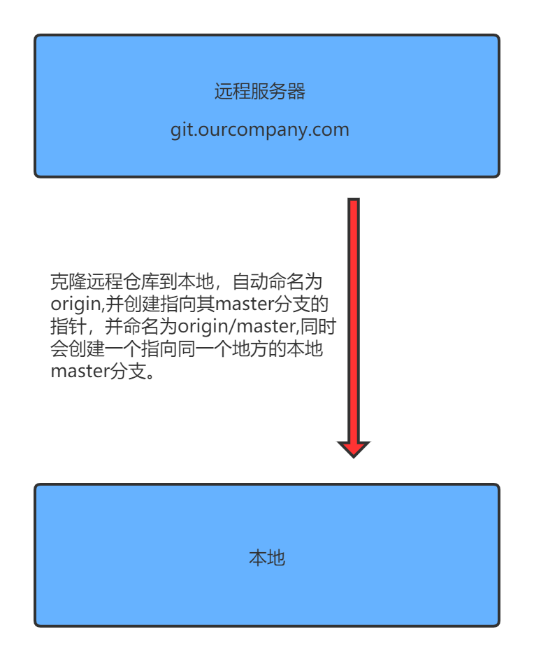

远程仓库：

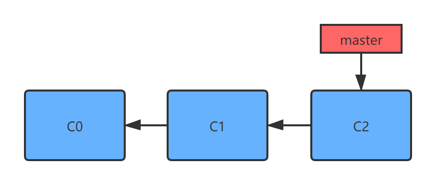

克隆到本地仓库：

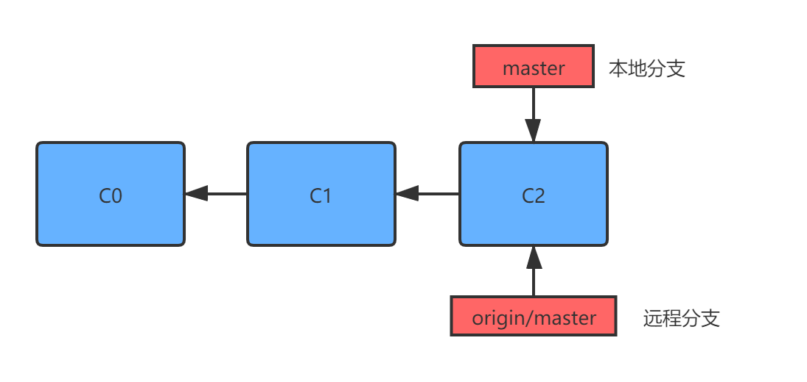

团队中其他人向远程的master分支提交了更新：

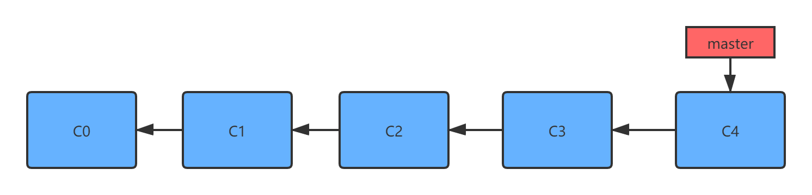

本地向master分支提交了更新：

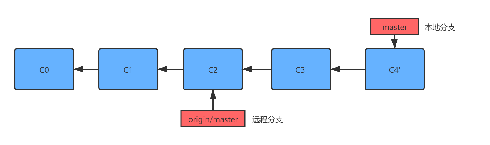

合并远程分支`git fetch origin`

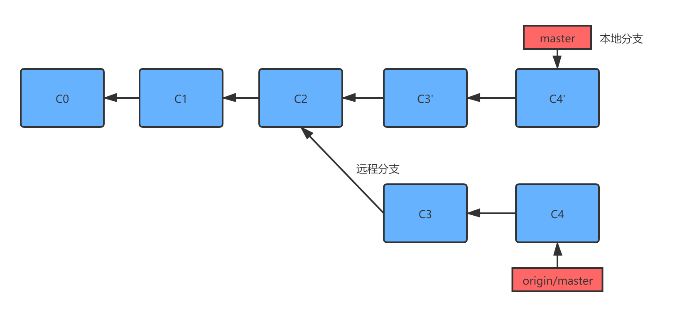

#### 4.1 向远程分支推送`git push`

```shell
$ git push origin serverfix
```

上面这条命令是将本地的`serverfix`分支推送到`origin`的`serverfix`分支。

```shell
$ git push origin serverfix:serverfix
```

这条命令与上面的命令作用相同。

```shell
$ git push origin serverfix:awesomebranch
Counting objects: 24, done.
Delta compression using up to 8 threads.
Compressing objects: 100% (15/15), done.
Writing objects: 100% (24/24), 1.91 KiB | 0 bytes/s, done.
Total 24 (delta 2), reused 0 (delta 0)
To https://github.com/schacon/simplegit
	* [new branch] serverfix -> awesomebranch
```

上面的命令可以将本地`serverfix`分支推送到远程的`awesomebranch`分支。

当远程仓库没有指定的分支时，会在远程仓库中创建该分支。

```shell
$ git fetch origin
remote: Counting objects: 7, done.
remote: Compressing objects: 100% (2/2), done.
remote: Total 3 (delta 0), reused 3 (delta 0)
Unpacking objects: 100% (3/3), done.
From https://github.com/schacon/simplegit
	* [new branch] serverfix -> origin/serverfix
```

其他人从远程分支抓取数据时会在本地创建一个远程分支`origin/serverfix`。

该命令只是在本地生成一个不可修改的`origin/serverfix`指针指向拷贝的分支。

如果想在该分支的基础上操作，可以执行下面的命令：

```shell
$ git checkout -b serverfix origin/serverfix
Branch serverfix set up to track remote branch serverfix from origin.
Switched to a new branch 'serverfix'
```

该命令会创建一个本地分支`serverfix`，并且起点位于`origin/serverfix`。

#### 4.2 跟踪分支

从一个远程跟踪分支检出一个本地分支会自动创建一个叫做 “跟踪分支”（有时候也叫做 “上游分支”）。跟踪分支是与远程分支有直接关系的本地分支。如果在一个跟踪分支上输入 git pull，Git能自动地识别去哪个服务器上抓取、合并到哪个分支。

当克隆一个仓库时，它通常会自动创建一个跟踪`origin/master`的`master`分支。你可以使用我们在上一节使用的`git checkout -b <bramch> <remotename>/<branch>`。因为这是一个非常常用的操作，所以GIt提供了一个`--track`快捷方式。

```shell
$ git checkout --track origin/serverfix
Branch serverfix set up to track remote branch serverfix from origin.
Switched to a new branch 'serverfix'
```

该命令会自动创建一个与远程分支名称相同的本地分支。

```shell
$ git checkout -b sf origin/serverfix
Branch sf set up to track remote branch serverfix from origin.
Switched to a new branch 'sf'
```

可以指定跟踪分支的名称。

```shell
$ git branch -u origin/serverfix
Branch serverfix set up to track remote branch serverfix from origin.
```

设置已有的分支来跟踪远程分支

```shell
$ git branch -u origin/serverfix
Branch serverfix set up to track remote branch serverfix from origin.
```

查看所有的跟踪分支：

```shell
$ git branch -vv
$ git branch -vv
	iss53 7e424c3 [origin/iss53: ahead 2] forgot the brackets
	master 1ae2a45 [origin/master] deploying index fix
	* serverfix f8674d9 [teamone/server-fix-good: ahead 3, behind 1] this
should do it
	testing 5ea463a trying something new
```

可以看到`iss53`分支正在跟踪的`origin/iss53`并且`ahead`是2，意味着本地还有两个提交没有推送到服务器上。

拉取所有的远程分支

```shell
$ git fetch -all
```

#### 4.3 删除远程分支

删除远程分支

```shell
$ git push origin --delete serverfix
To https://github.com/schacon/simplegit
 - [deleted] serverfix
```

删除git服务器上的`serverfix`分支。

### 5. 变基

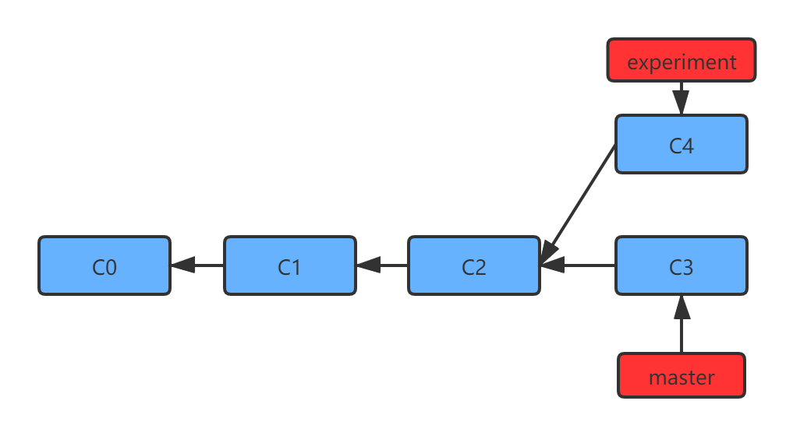

当前提交记录

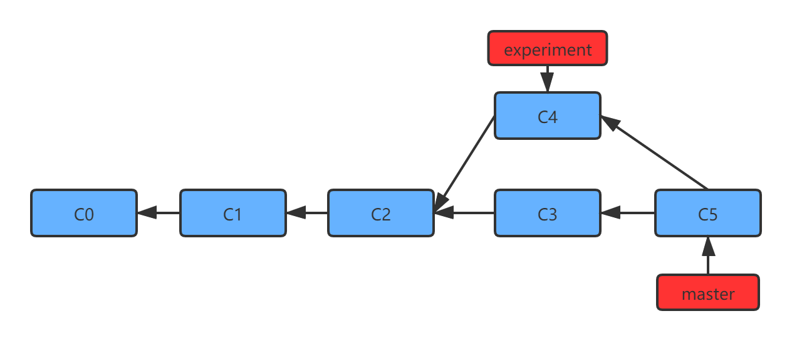

合并操作

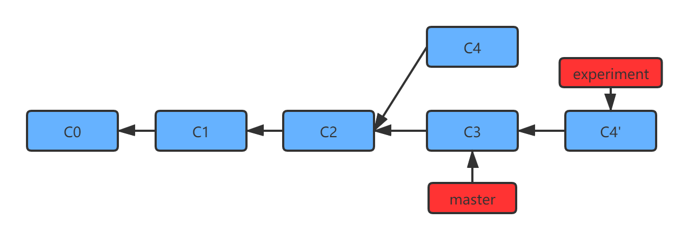

变基操作 ，变基操作的基本原理是首先找到两个分支的共同祖先`C2`，然后对比当前分支相对于该祖先的历次提交，提取相应的修改为临时文件，然后将当前分支指向目标基底`C3`，最后将临时文件的修改依序应用。

```shell
$ git checkout experiment
$ git rebase master
$ git checkout master
$ git merge experiment
```

`git rebase branch`的目的是将当前分支变基到指定的分支上，我们还可以指定要操作的分支`git rebase [basebranch] [topicbranch]`。

```shell
$ git rebase master experiment
```


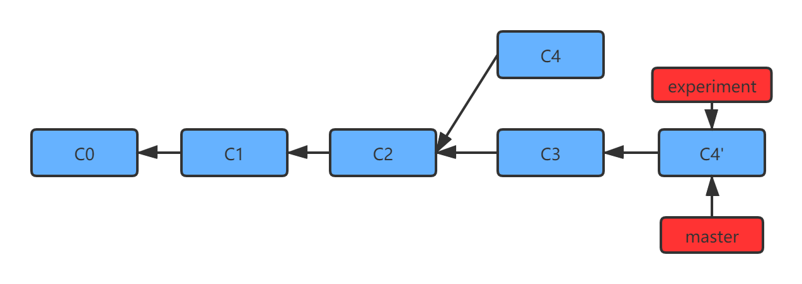

### 6. 更有趣的变基的例子 

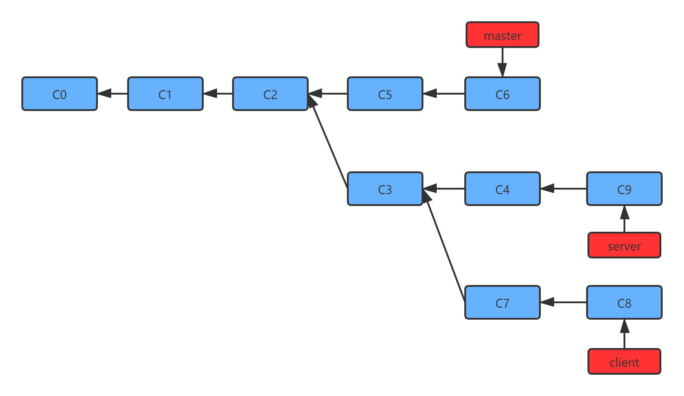

现在的提交记录形如上面的图片所展示的那样，而我们的需求是将`client`上的分支合并到`master`分支上，而不将`server`分支的工作合并，这时我们将使用下面的这条命令

```shell
$ git rebase --onto master server client
```

上面命令的意思是取出`client`分支，找出处于`client`分支与`server`分支共同祖先之后修改，然后将他们在`master`分支上重演一遍。

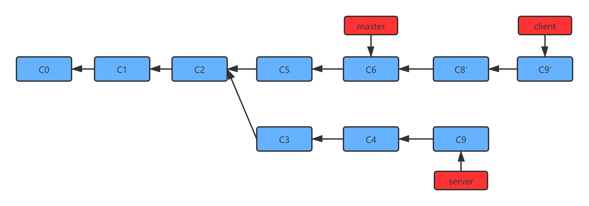

在进行变基的时候，需要注意的是**不要对在你的仓库外有副本的分支执行变基**。