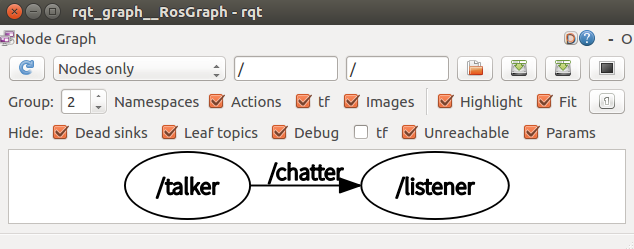

# 测试发布者和订阅者

**描述**：这个教程测试运行了发布者和订阅者

### 1. 运行发布者

```shell
$ cd ~/catkin_ws
$ source ./devel/setup.bash
$ rosrun beginner_tutorials talker
```

### 2. 运行订阅者

```shell
$ cd ~/catkin_ws
$ source ./devel/setup.bash
$ rosrun beginner_tutorials listener
```

